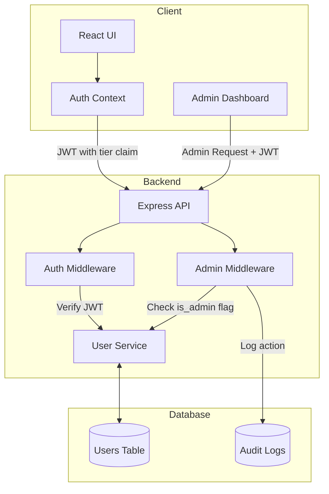
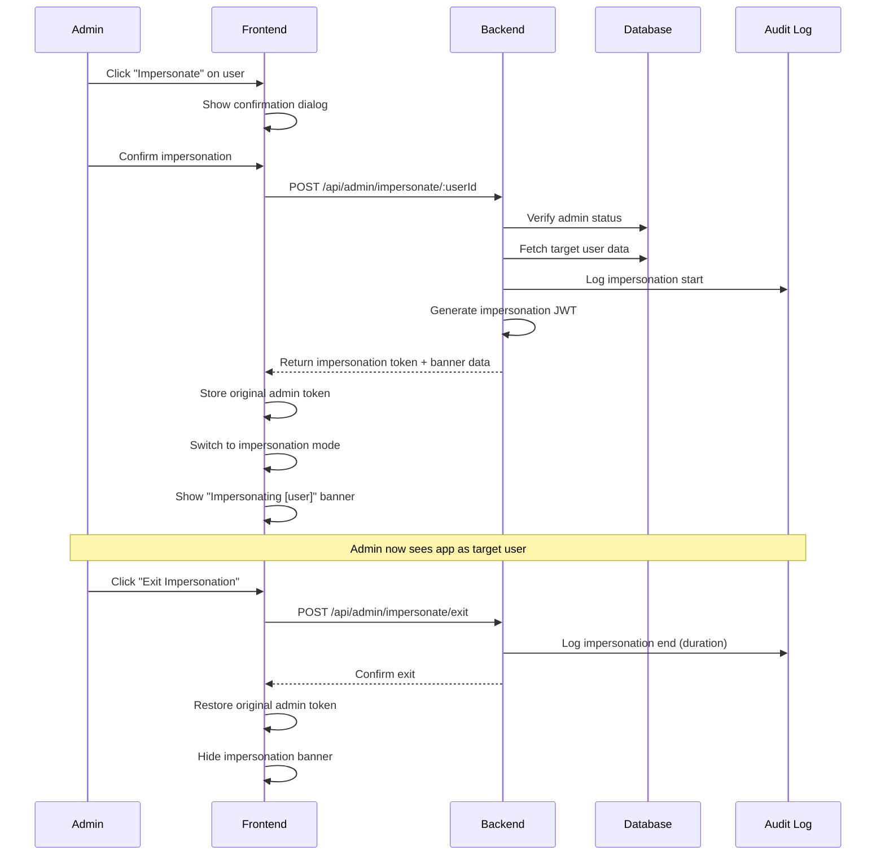

# Admin Role Implementation Plan

## 1. Executive Summary

This document outlines the architectural design and implementation strategy for introducing an **Admin** role to CardCraft Studio. The admin role will exist alongside the existing tiers (Guest, Free, Premium) and provide privileged access to administrative functions while inheriting all premium features.

**Key Objectives:**
- Add a fourth tier: **Admin** (with all Premium privileges + administrative capabilities)
- Create a secure admin interface for platform management
- Establish a bootstrap mechanism for the first admin
- Define admin-specific features and permissions
- Maintain clear separation between public-facing features and admin capabilities

---

## 2. User Tier Matrix (Updated)

| Feature                    | Guest (Anonymous) | Free (Logged In) | Premium (Subscriber) | **Admin** |
| :------------------------- | :---------------- | :--------------- | :------------------- | :-------- |
| **Card Editing**           | ✅ Full access     | ✅ Full access    | ✅ Full access        | ✅ Full access |
| **Local Storage**          | ✅ Enabled        | ✅ Enabled       | ✅ Enabled           | ✅ Enabled |
| **Google Drive Sync**      | ❌ Disabled       | ✅ Enabled       | ✅ Enabled           | ✅ Enabled |
| **AI Image Search**        | ❌ Disabled       | ⚠️ Limited (3/day)| ✅ Unlimited         | ✅ Unlimited |
| **AI Generation**          | ❌ Disabled       | ❌ Disabled      | ✅ Unlimited         | ✅ Unlimited |
| **Premium Templates**      | ❌ Disabled       | ❌ Disabled      | ✅ Exclusive access  | ✅ Exclusive access |
| **User Management**        | ❌ Disabled       | ❌ Disabled      | ❌ Disabled          | ✅ Admin only |
| **Analytics Dashboard**    | ❌ Disabled       | ❌ Disabled      | ❌ Disabled          | ✅ Admin only |
| **System Configuration**   | ❌ Disabled       | ❌ Disabled      | ❌ Disabled          | ✅ Admin only |
| **Subscription Override**  | ❌ Disabled       | ❌ Disabled      | ❌ Disabled          | ✅ Admin only |
| **Feature Flags Control**  | ❌ Disabled       | ❌ Disabled      | ❌ Disabled          | ✅ Admin only |
| **Audit Logs Access**      | ❌ Disabled       | ❌ Disabled      | ❌ Disabled          | ✅ Admin only |
| **User Impersonation**     | ❌ Disabled       | ❌ Disabled      | ❌ Disabled          | ✅ Admin only |

**Note:** The Admin tier is **NOT** advertised on the public landing page. It's an internal role for platform operators.

---

## 3. Admin Role Architecture

### 3.1 Data Model Changes

#### Updated User Schema

```sql
CREATE TABLE users (
  google_id VARCHAR PRIMARY KEY,
  email VARCHAR NOT NULL,
  tier VARCHAR DEFAULT 'free', -- 'free', 'premium', 'admin'
  stripe_customer_id VARCHAR,
  stripe_subscription_id VARCHAR,
  created_at TIMESTAMP DEFAULT NOW(),
  updated_at TIMESTAMP DEFAULT NOW(),
  last_login TIMESTAMP,
  
  -- Admin-specific fields
  is_admin BOOLEAN DEFAULT FALSE,
  admin_granted_by VARCHAR REFERENCES users(google_id),
  admin_granted_at TIMESTAMP,
  admin_notes TEXT
);

-- Index for quick admin lookups
CREATE INDEX idx_users_is_admin ON users(is_admin) WHERE is_admin = TRUE;
```

#### New Admin Audit Log Table

```sql
CREATE TABLE admin_audit_logs (
  id UUID PRIMARY KEY DEFAULT gen_random_uuid(),
  admin_id VARCHAR NOT NULL REFERENCES users(google_id),
  action VARCHAR NOT NULL, -- 'grant_admin', 'revoke_admin', 'override_subscription', 'impersonate_user', etc.
  target_user_id VARCHAR REFERENCES users(google_id),
  details JSONB, -- Flexible storage for action-specific data
  ip_address VARCHAR,
  user_agent TEXT,
  created_at TIMESTAMP DEFAULT NOW(),
  ended_at TIMESTAMP -- For tracking impersonation session duration
);

CREATE INDEX idx_audit_admin_id ON admin_audit_logs(admin_id);
CREATE INDEX idx_audit_created_at ON admin_audit_logs(created_at DESC);
```

### 3.2 Authentication & Authorization Flow



---

## 4. Bootstrap Strategy: First Admin Setup

### Option A: Environment Variable Bootstrap (RECOMMENDED)

**Approach:** Use an environment variable to designate the first admin by email.

**Implementation:**
1. Add `ADMIN_BOOTSTRAP_EMAIL` to environment variables (e.g., `ADMIN_BOOTSTRAP_EMAIL=antonio.aloisio@zalando.de`)
2. On first login, the backend checks if the user's email matches `ADMIN_BOOTSTRAP_EMAIL`
3. If matched, automatically set `is_admin = TRUE` and `tier = 'admin'`
4. Log this action in the audit log with `admin_granted_by = 'SYSTEM_BOOTSTRAP'`

**Pros:**
- Simple and secure
- No special setup UI needed
- Can be configured via Cloud Run environment variables
- Easy to audit (appears in deployment config)

**Cons:**
- Requires deployment/restart to change
- Only works for the very first admin

**Code Flow:**
```javascript
// Backend: /auth/login endpoint
async function handleLogin(idToken) {
  const googleUser = await verifyGoogleToken(idToken);
  let user = await getUserByGoogleId(googleUser.sub);
  
  if (!user) {
    // New user - check if bootstrap admin
    const isBootstrapAdmin = googleUser.email === process.env.ADMIN_BOOTSTRAP_EMAIL;
    
    user = await createUser({
      google_id: googleUser.sub,
      email: googleUser.email,
      tier: isBootstrapAdmin ? 'admin' : 'free',
      is_admin: isBootstrapAdmin
    });
    
    if (isBootstrapAdmin) {
      await logAdminAction({
        admin_id: user.google_id,
        action: 'bootstrap_admin',
        details: { method: 'environment_variable' }
      });
    }
  }
  
  return generateJWT(user);
}
```

### Option B: Database Seed Script

**Approach:** Run a one-time migration script to promote a user to admin.

**Implementation:**
```sql
-- Run once during initial deployment
UPDATE users 
SET 
  tier = 'admin',
  is_admin = TRUE,
  admin_granted_by = 'SYSTEM_SEED',
  admin_granted_at = NOW(),
  admin_notes = 'Initial bootstrap admin'
WHERE email = 'antonio.aloisio@zalando.de';
```

**Pros:**
- Explicit and auditable
- Can be version-controlled as a migration
- Works even if user already exists

**Cons:**
- Requires database access
- Manual step in deployment process

### Option C: Secret Admin Endpoint (NOT RECOMMENDED)

A protected endpoint that requires a secret token to grant admin access. **Not recommended** due to security concerns.

---

## 5. Granting Admin to Additional Users

Once the first admin exists, they can promote other users through the **Admin Dashboard**.

### 5.1 Admin Dashboard - User Management Interface

**Features:**
- **User Search:** Search by email or Google ID
- **User List:** Paginated table showing all users with tier, subscription status, last login
- **Grant Admin:** Button to promote a user to admin (with confirmation dialog)
- **Revoke Admin:** Button to demote an admin to their previous tier
- **Subscription Override:** Manually grant/revoke premium access (useful for testing, comps, support)
- **User Activity:** View user's recent actions and usage stats

**UI Mockup (Text Description):**
```
┌─────────────────────────────────────────────────────────┐
│  Admin Dashboard - User Management                      │
├─────────────────────────────────────────────────────────┤
│  Search: [antonio@example.com]          [Search]        │
│                                                          │
│  ┌────────────────────────────────────────────────────┐ │
│  │ Email              │ Tier    │ Last Login │ Actions││ │
│  ├────────────────────────────────────────────────────┤ │
│  │ user1@gmail.com    │ Free    │ 2h ago     │ [Edit] ││ │
│  │ user2@gmail.com    │ Premium │ 1d ago     │ [Edit] ││ │
│  │ admin@zalando.de   │ Admin   │ 5m ago     │ [Edit] ││ │
│  └────────────────────────────────────────────────────┘ │
│                                                          │
│  [← Previous]  Page 1 of 42  [Next →]                   │
└─────────────────────────────────────────────────────────┘
```

### 5.2 Backend API Endpoints

```typescript
// Admin-only endpoints (require AdminMiddleware)

// GET /api/admin/users
// List all users with pagination and filtering
interface GetUsersRequest {
  page?: number;
  limit?: number;
  search?: string; // Email or Google ID
  tier?: 'free' | 'premium' | 'admin';
}

// POST /api/admin/users/:userId/grant-admin
// Promote a user to admin
interface GrantAdminRequest {
  notes?: string; // Optional reason for granting admin
}

// POST /api/admin/users/:userId/revoke-admin
// Demote an admin to their previous tier
interface RevokeAdminRequest {
  notes?: string;
}

// POST /api/admin/users/:userId/override-subscription
// Manually set a user's tier (bypass Stripe)
interface OverrideSubscriptionRequest {
  tier: 'free' | 'premium';
  reason: string; // Required for audit
  expires_at?: Date; // Optional expiration for temporary access
}

// GET /api/admin/audit-logs
// View audit log of all admin actions
interface GetAuditLogsRequest {
  page?: number;
  limit?: number;
  admin_id?: string; // Filter by specific admin
  action?: string; // Filter by action type
}

// GET /api/admin/analytics
// Platform-wide analytics
interface AnalyticsResponse {
  total_users: number;
  users_by_tier: { free: number; premium: number; admin: number };
  active_subscriptions: number;
  monthly_revenue: number;
  ai_requests_today: number;
  // ... more metrics
}
```

### 5.3 Middleware Implementation

```typescript
// middleware/requireAdmin.ts
export async function requireAdmin(req: Request, res: Response, next: NextFunction) {
  try {
    // First, verify authentication (reuse existing auth middleware)
    const user = req.user; // Set by auth middleware
    
    if (!user) {
      return res.status(401).json({ error: 'Not authenticated' });
    }
    
    // Check admin status
    if (!user.is_admin || user.tier !== 'admin') {
      // Log unauthorized access attempt
      await logSecurityEvent({
        type: 'unauthorized_admin_access',
        user_id: user.google_id,
        ip: req.ip,
        endpoint: req.path
      });
      
      return res.status(403).json({ error: 'Admin access required' });
    }
    
    // Attach admin context for audit logging
    req.adminContext = {
      admin_id: user.google_id,
      ip: req.ip,
      user_agent: req.headers['user-agent']
    };
    
    next();
  } catch (error) {
    next(error);
  }
}
```

---

## 6. Admin-Specific Features

### 6.1 User Management
- View all users with search and filtering
- Grant/revoke admin privileges
- Override subscription status (for support/testing)
- **Impersonate users** to debug issues and test tier-specific features
- View user activity and usage patterns
- Suspend/unsuspend accounts (future enhancement)

### 6.2 Analytics Dashboard
- **User Metrics:**
  - Total users by tier
  - New signups (daily/weekly/monthly)
  - Churn rate
  - Active users (DAU/MAU)
  
- **Revenue Metrics:**
  - MRR (Monthly Recurring Revenue)
  - Conversion rate (Free → Premium)
  - Subscription lifecycle stats
  
- **Usage Metrics:**
  - AI requests per day
  - Most popular features
  - Google Drive sync usage
  - Error rates and performance

### 6.3 System Configuration
- **Feature Flags:**
  - Enable/disable features globally
  - A/B testing toggles
  - Gradual rollout controls
  
- **Rate Limits:**
  - Adjust AI request limits for Free tier
  - Set global rate limits
  
- **Maintenance Mode:**
  - Enable read-only mode
  - Display custom maintenance message

### 6.4 Audit Logs
- View all admin actions with timestamps
- Filter by admin, action type, date range
- Export logs for compliance
- Immutable log storage (append-only)

### 6.5 User Impersonation (Core Feature)

**Purpose:** Allow admins to experience the application as any user tier (Guest, Free, Premium) for debugging, support, and testing purposes.

#### 6.5.1 Use Cases
1. **Support Debugging:** Reproduce user-reported issues by viewing their exact experience
2. **Tier Testing:** Test how features behave for different subscription levels without creating test accounts
3. **UX Validation:** Verify that tier restrictions are working correctly
4. **Training:** Demonstrate the user experience to stakeholders

#### 6.5.2 Impersonation Architecture



#### 6.5.3 Technical Implementation

**Backend: Impersonation Token Structure**

The impersonation JWT contains both admin and target user information:

```typescript
interface ImpersonationJWT {
  // Target user (who we're impersonating)
  sub: string;              // Target user's google_id
  email: string;            // Target user's email
  tier: 'free' | 'premium'; // Target user's tier (never 'admin')
  
  // Admin context (who is impersonating)
  admin_id: string;         // Admin's google_id
  admin_email: string;      // Admin's email
  is_impersonating: true;   // Flag to identify impersonation
  
  // Session metadata
  impersonation_started_at: number; // Unix timestamp
  impersonation_session_id: string; // UUID for audit trail
  
  // Standard JWT fields
  iat: number;
  exp: number; // Short expiration (e.g., 1 hour)
}
```

**Backend: API Endpoints**

```typescript
// POST /api/admin/impersonate/:userId
// Start impersonating a user
interface ImpersonateRequest {
  reason?: string; // Optional reason for impersonation
}

interface ImpersonateResponse {
  impersonation_token: string; // JWT with impersonation context
  target_user: {
    google_id: string;
    email: string;
    tier: string;
  };
  session_id: string; // For tracking in audit logs
}

// POST /api/admin/impersonate/exit
// Exit impersonation mode
interface ExitImpersonationResponse {
  success: boolean;
  duration_seconds: number; // How long the impersonation lasted
}

// GET /api/admin/impersonation-sessions
// View active and past impersonation sessions
interface ImpersonationSession {
  session_id: string;
  admin_email: string;
  target_user_email: string;
  started_at: Date;
  ended_at: Date | null; // null if still active
  duration_seconds: number | null;
  reason: string | null;
}
```

**Backend: Middleware Updates**

```typescript
// middleware/auth.ts - Updated to handle impersonation
export async function authenticateRequest(req: Request, res: Response, next: NextFunction) {
  const token = extractTokenFromHeader(req);
  const decoded = verifyJWT(token);
  
  if (decoded.is_impersonating) {
    // Impersonation mode
    req.user = {
      google_id: decoded.sub,        // Target user
      email: decoded.email,
      tier: decoded.tier,
      is_impersonating: true
    };
    
    req.impersonationContext = {
      admin_id: decoded.admin_id,
      admin_email: decoded.admin_email,
      session_id: decoded.impersonation_session_id,
      started_at: decoded.impersonation_started_at
    };
    
    // Log impersonated actions (optional, for detailed audit)
    req.on('finish', () => {
      if (shouldLogAction(req.path)) {
        logImpersonatedAction({
          session_id: req.impersonationContext.session_id,
          admin_id: req.impersonationContext.admin_id,
          action: `${req.method} ${req.path}`,
          as_user: req.user.google_id
        });
      }
    });
  } else {
    // Normal mode
    req.user = {
      google_id: decoded.sub,
      email: decoded.email,
      tier: decoded.tier,
      is_admin: decoded.is_admin || false
    };
  }
  
  next();
}

// middleware/requireAdmin.ts - Updated to prevent impersonation of admins
export async function requireAdmin(req: Request, res: Response, next: NextFunction) {
  // Impersonating users cannot access admin routes
  if (req.user?.is_impersonating) {
    return res.status(403).json({ 
      error: 'Admin access not available during impersonation' 
    });
  }
  
  // ... rest of admin check
}
```

**Backend: Impersonation Controller**

```typescript
// controllers/impersonationController.ts
export async function startImpersonation(req: Request, res: Response) {
  const adminUser = req.user; // Set by requireAdmin middleware
  const targetUserId = req.params.userId;
  const { reason } = req.body;
  
  // Fetch target user
  const targetUser = await getUserByGoogleId(targetUserId);
  
  if (!targetUser) {
    return res.status(404).json({ error: 'User not found' });
  }
  
  // Security: Prevent impersonating other admins
  if (targetUser.is_admin || targetUser.tier === 'admin') {
    await logSecurityEvent({
      type: 'attempted_admin_impersonation',
      admin_id: adminUser.google_id,
      target_user_id: targetUserId,
      ip: req.ip
    });
    
    return res.status(403).json({ 
      error: 'Cannot impersonate admin users' 
    });
  }
  
  // Create impersonation session
  const sessionId = generateUUID();
  const impersonationToken = generateJWT({
    sub: targetUser.google_id,
    email: targetUser.email,
    tier: targetUser.tier,
    admin_id: adminUser.google_id,
    admin_email: adminUser.email,
    is_impersonating: true,
    impersonation_started_at: Date.now(),
    impersonation_session_id: sessionId
  }, { expiresIn: '1h' }); // Short expiration for security
  
  // Log in audit trail
  await logAdminAction({
    admin_id: adminUser.google_id,
    action: 'impersonate_user',
    target_user_id: targetUser.google_id,
    details: {
      session_id: sessionId,
      target_tier: targetUser.tier,
      reason: reason || 'No reason provided'
    },
    ip: req.ip,
    user_agent: req.headers['user-agent']
  });
  
  return res.json({
    impersonation_token: impersonationToken,
    target_user: {
      google_id: targetUser.google_id,
      email: targetUser.email,
      tier: targetUser.tier
    },
    session_id: sessionId
  });
}

export async function exitImpersonation(req: Request, res: Response) {
  if (!req.impersonationContext) {
    return res.status(400).json({ error: 'Not in impersonation mode' });
  }
  
  const { session_id, started_at, admin_id } = req.impersonationContext;
  const durationSeconds = Math.floor((Date.now() - started_at) / 1000);
  
  // Update audit log with end time
  await updateAuditLog(session_id, {
    ended_at: new Date(),
    details: { duration_seconds: durationSeconds }
  });
  
  return res.json({
    success: true,
    duration_seconds: durationSeconds
  });
}
```

#### 6.5.4 Frontend Implementation

**Impersonation Banner Component**

```typescript
// components/ImpersonationBanner.tsx
export function ImpersonationBanner() {
  const { user, impersonationContext, exitImpersonation } = useAuth();
  
  if (!impersonationContext) return null;
  
  return (
    <div className="impersonation-banner">
      <div className="banner-content">
        <AlertIcon />
        <span>
          You are viewing as <strong>{user.email}</strong> ({user.tier})
        </span>
        <span className="admin-info">
          Admin: {impersonationContext.admin_email}
        </span>
      </div>
      <button 
        onClick={exitImpersonation}
        className="exit-button"
      >
        Exit Impersonation
      </button>
    </div>
  );
}
```

**Updated Auth Context**

```typescript
// contexts/AuthContext.tsx
interface AuthContextType {
  user: User | null;
  impersonationContext: ImpersonationContext | null;
  login: (token: string) => void;
  logout: () => void;
  impersonateUser: (userId: string, reason?: string) => Promise<void>;
  exitImpersonation: () => Promise<void>;
}

export function AuthProvider({ children }) {
  const [user, setUser] = useState<User | null>(null);
  const [impersonationContext, setImpersonationContext] = useState<ImpersonationContext | null>(null);
  const [originalAdminToken, setOriginalAdminToken] = useState<string | null>(null);
  
  const impersonateUser = async (userId: string, reason?: string) => {
    // Store current admin token
    const currentToken = localStorage.getItem('auth_token');
    setOriginalAdminToken(currentToken);
    
    // Request impersonation token
    const response = await fetch(`/api/admin/impersonate/${userId}`, {
      method: 'POST',
      headers: {
        'Authorization': `Bearer ${currentToken}`,
        'Content-Type': 'application/json'
      },
      body: JSON.stringify({ reason })
    });
    
    const data = await response.json();
    
    // Switch to impersonation mode
    localStorage.setItem('auth_token', data.impersonation_token);
    localStorage.setItem('original_admin_token', currentToken);
    
    // Decode and set user context
    const decoded = decodeJWT(data.impersonation_token);
    setUser({
      google_id: decoded.sub,
      email: decoded.email,
      tier: decoded.tier,
      is_impersonating: true
    });
    
    setImpersonationContext({
      admin_id: decoded.admin_id,
      admin_email: decoded.admin_email,
      session_id: decoded.impersonation_session_id,
      target_user: data.target_user
    });
  };
  
  const exitImpersonation = async () => {
    // Notify backend
    await fetch('/api/admin/impersonate/exit', {
      method: 'POST',
      headers: {
        'Authorization': `Bearer ${localStorage.getItem('auth_token')}`
      }
    });
    
    // Restore admin token
    const adminToken = localStorage.getItem('original_admin_token');
    localStorage.setItem('auth_token', adminToken);
    localStorage.removeItem('original_admin_token');
    
    // Restore admin user context
    const decoded = decodeJWT(adminToken);
    setUser({
      google_id: decoded.sub,
      email: decoded.email,
      tier: decoded.tier,
      is_admin: decoded.is_admin
    });
    
    setImpersonationContext(null);
    
    // Redirect to admin dashboard
    window.location.href = '/admin/users';
  };
  
  // ... rest of auth context
}
```

**User Management UI with Impersonate Button**

```typescript
// pages/admin/UserManagement.tsx
function UserRow({ user }) {
  const { impersonateUser } = useAuth();
  const [showImpersonateDialog, setShowImpersonateDialog] = useState(false);
  
  const handleImpersonate = async (reason: string) => {
    await impersonateUser(user.google_id, reason);
    setShowImpersonateDialog(false);
  };
  
  return (
    <tr>
      <td>{user.email}</td>
      <td><TierBadge tier={user.tier} /></td>
      <td>{formatDate(user.last_login)}</td>
      <td>
        <button onClick={() => setShowImpersonateDialog(true)}>
          <EyeIcon /> View As
        </button>
        {/* ... other actions */}
      </td>
      
      {showImpersonateDialog && (
        <ImpersonateDialog
          user={user}
          onConfirm={handleImpersonate}
          onCancel={() => setShowImpersonateDialog(false)}
        />
      )}
    </tr>
  );
}
```

#### 6.5.5 Security Considerations

**Critical Security Rules:**

1. **No Admin Impersonation:** Admins cannot impersonate other admins
   - Prevents privilege escalation
   - Logged as security event if attempted

2. **Short Session Duration:** Impersonation tokens expire after 1 hour
   - Forces periodic re-authentication
   - Reduces risk of token theft

3. **Admin Routes Blocked:** Impersonating users cannot access `/admin/*` routes
   - Even though the underlying user is an admin
   - Prevents accidental admin actions while impersonating

4. **Comprehensive Audit Logging:**
   - Log when impersonation starts
   - Log when impersonation ends (with duration)
   - Optionally log all actions taken during impersonation
   - Include reason for impersonation

5. **Visual Indicators:** Prominent banner at all times during impersonation
   - Prevents admins from forgetting they're impersonating
   - Shows both target user and admin identity

6. **Automatic Exit on Token Expiry:** Frontend detects expired impersonation token
   - Automatically restores admin session
   - Shows notification to admin

7. **Rate Limiting:** Limit number of impersonation sessions per admin per day
   - Prevents abuse
   - Alert on excessive impersonation

#### 6.5.6 UI/UX Design

**Impersonation Banner Styling:**
```css
.impersonation-banner {
  position: fixed;
  top: 0;
  left: 0;
  right: 0;
  z-index: 9999;
  background: linear-gradient(135deg, #ff6b6b, #ee5a6f);
  color: white;
  padding: 12px 24px;
  display: flex;
  justify-content: space-between;
  align-items: center;
  box-shadow: 0 2px 8px rgba(0,0,0,0.2);
  font-weight: 500;
}

.banner-content {
  display: flex;
  align-items: center;
  gap: 16px;
}

.exit-button {
  background: white;
  color: #ff6b6b;
  border: none;
  padding: 8px 16px;
  border-radius: 6px;
  font-weight: 600;
  cursor: pointer;
  transition: transform 0.2s;
}

.exit-button:hover {
  transform: scale(1.05);
}
```

**Impersonation Confirmation Dialog:**
```
┌─────────────────────────────────────────────┐
│  Impersonate User                           │
├─────────────────────────────────────────────┤
│                                             │
│  You are about to view the application as:  │
│                                             │
│  📧 user@example.com                        │
│  🎫 Tier: Free                              │
│                                             │
│  Reason (optional):                         │
│  ┌─────────────────────────────────────┐   │
│  │ Debugging reported sync issue       │   │
│  └─────────────────────────────────────┘   │
│                                             │
│  ⚠️  All actions will be logged             │
│  ⏱️  Session expires in 1 hour              │
│                                             │
│  [Cancel]              [Start Impersonation]│
└─────────────────────────────────────────────┘
```

#### 6.5.7 Testing Impersonation

**Test Cases:**

1. **Happy Path:**
   - Admin impersonates Free user → sees Free tier restrictions
   - Admin impersonates Premium user → sees Premium features
   - Admin exits impersonation → returns to admin dashboard

2. **Security Tests:**
   - Non-admin attempts impersonation → 403 error
   - Admin attempts to impersonate another admin → 403 error
   - Impersonating user attempts to access `/admin` → 403 error
   - Expired impersonation token → auto-logout and restore admin session

3. **Audit Tests:**
   - Impersonation start is logged with session ID
   - Impersonation end is logged with duration
   - All logs include admin ID and target user ID

4. **Edge Cases:**
   - Admin closes browser during impersonation → session expires, can resume as admin
   - Admin tries to impersonate non-existent user → 404 error
   - Multiple admins impersonate same user → separate sessions, no conflicts

#### 6.5.8 Monitoring & Alerts

**Metrics to Track:**
- Number of impersonation sessions per day
- Average impersonation duration
- Most frequently impersonated users (may indicate recurring issues)
- Admins with highest impersonation usage

**Alerts:**
- **Warning:** Admin impersonates more than 10 users in one day
- **Warning:** Impersonation session exceeds 2 hours (token should expire at 1h)
- **Critical:** Attempted impersonation of admin user
- **Info:** Impersonation session started (for real-time awareness)

---

## 7. Frontend Implementation

### 7.1 Admin Route Protection

```typescript
// App.tsx or Router configuration
import { useAuth } from './contexts/AuthContext';
import AdminDashboard from './pages/AdminDashboard';

function App() {
  const { user } = useAuth();
  
  return (
    <Routes>
      {/* Public routes */}
      <Route path="/" element={<LandingPage />} />
      <Route path="/editor" element={<CardEditor />} />
      
      {/* Admin-only routes */}
      {user?.tier === 'admin' && (
        <Route path="/admin/*" element={<AdminDashboard />} />
      )}
    </Routes>
  );
}
```

### 7.2 Admin Navigation

Add a subtle admin link in the navbar (only visible to admins):

```typescript
// Navbar.tsx
{user?.tier === 'admin' && (
  <Link 
    to="/admin" 
    className="admin-link"
    title="Admin Dashboard"
  >
    <AdminIcon /> Admin
  </Link>
)}
```

### 7.3 Admin Dashboard Structure

```
/admin
  /users          - User management
  /analytics      - Platform analytics
  /audit-logs     - Admin action history
  /config         - System configuration
  /feature-flags  - Feature toggle management
```

---

## 8. Security Considerations

### 8.1 Authentication
- ✅ Admin status must be verified on **every** request (never trust frontend)
- ✅ Use JWT with `tier: 'admin'` claim, but always cross-check with database
- ✅ Implement token refresh to prevent stale admin status

### 8.2 Authorization
- ✅ All admin endpoints must use `requireAdmin` middleware
- ✅ Never expose admin endpoints in public API documentation
- ✅ Rate limit admin endpoints to prevent abuse

### 8.3 Audit Trail
- ✅ Log **every** admin action with timestamp, IP, and user agent
- ✅ Make audit logs immutable (append-only)
- ✅ Alert on suspicious patterns (e.g., mass user deletions)

### 8.4 Principle of Least Privilege
- ✅ Admins should use regular accounts for normal usage
- ✅ Consider implementing "admin mode" toggle (like sudo)
- ✅ Auto-logout after inactivity in admin dashboard

### 8.5 Multi-Factor Authentication (Future Enhancement)
- Consider requiring MFA for admin accounts
- Implement step-up authentication for sensitive actions

---

## 9. Landing Page Tier Comparison Table

The landing page should clearly show the three public tiers (Guest, Free, Premium) **without** mentioning Admin.

### Proposed Table Design

```markdown
| Feature                | Guest        | Free         | Premium      |
| :--------------------- | :----------- | :----------- | :----------- |
| Card Creation          | ✅ Unlimited  | ✅ Unlimited  | ✅ Unlimited  |
| Local Storage          | ✅ Included   | ✅ Included   | ✅ Included   |
| Google Drive Sync      | ❌           | ✅ Included   | ✅ Included   |
| AI Image Search        | ❌           | ⚠️ 3 per day  | ✅ Unlimited  |
| AI Card Generation     | ❌           | ❌           | ✅ Unlimited  |
| Premium Templates      | ❌           | ❌           | ✅ Exclusive  |
| Priority Support       | ❌           | ❌           | ✅ Included   |
| **Price**              | Free         | Free         | $9.99/month  |
```

**Visual Treatment:**
- Use a glassmorphic card design for each tier
- Highlight Premium with a "Most Popular" badge
- Animate the Premium column on hover
- Use checkmarks (✅), crosses (❌), and warning icons (⚠️) for clarity

---

## 10. Implementation Phases

### Phase 1: Database & Backend Foundation (Week 1)
- [ ] Update user schema to include `is_admin` and admin-related fields
- [ ] Create `admin_audit_logs` table
- [ ] Implement `requireAdmin` middleware
- [ ] Add admin bootstrap logic to `/auth/login` endpoint
- [ ] Create admin user management endpoints (`/api/admin/users/*`)
- [ ] Implement audit logging service

### Phase 2: Admin Dashboard UI (Week 2)
- [ ] Create admin route structure (`/admin/*`)
- [ ] Build User Management page with search and filtering
- [ ] Implement Grant/Revoke Admin UI with confirmation dialogs
- [ ] Create Subscription Override interface
- [ ] **Add "View As" (Impersonate) button to user management**
- [ ] **Build Impersonation confirmation dialog**
- [ ] **Create ImpersonationBanner component**
- [ ] Add admin navigation link (visible only to admins)
- [ ] Implement responsive design for admin dashboard

### Phase 3: Analytics & Monitoring (Week 3)
- [ ] Build analytics data aggregation service
- [ ] Create Analytics Dashboard UI with charts
- [ ] Implement Audit Logs viewer with filtering
- [ ] **Add Impersonation Sessions viewer to audit logs**
- [ ] Add real-time metrics (optional: WebSocket or polling)
- [ ] Create export functionality for audit logs

### Phase 4: Advanced Features (Week 4)
- [ ] **Implement impersonation backend endpoints (`/api/admin/impersonate/*`)**
- [ ] **Update auth middleware to handle impersonation tokens**
- [ ] **Add impersonation session tracking and auto-expiry**
- [ ] **Implement impersonation audit logging with duration tracking**
- [ ] Implement Feature Flags system
- [ ] Create System Configuration interface
- [ ] Add maintenance mode toggle
- [ ] Implement rate limit configuration UI
- [ ] Add email notifications for admin actions (optional)

### Phase 5: Landing Page Update (Week 5)
- [ ] Design and implement tier comparison table
- [ ] Update landing page copy to emphasize tiers
- [ ] Add visual cues for premium features
- [ ] Ensure admin tier is **not** mentioned publicly
- [ ] A/B test different pricing presentations

### Phase 6: Security Hardening & Testing (Week 6)
- [ ] Security audit of admin endpoints
- [ ] Penetration testing for privilege escalation
- [ ] Implement rate limiting on admin endpoints
- [ ] Add alerting for suspicious admin activity
- [ ] Load testing for analytics queries
- [ ] End-to-end testing of admin workflows

---

## 11. Testing Strategy

### 11.1 Unit Tests
- Test `requireAdmin` middleware with various user tiers
- Test admin action logging
- Test subscription override logic
- Test analytics data aggregation
- **Test impersonation token generation and validation**
- **Test impersonation middleware logic**

### 11.2 Integration Tests
- Test complete admin grant/revoke flow
- Test audit log creation for all admin actions
- Test admin dashboard data fetching
- Test feature flag toggles
- **Test complete impersonation flow (start → use → exit)**
- **Test impersonation session duration tracking**

### 11.3 E2E Tests
- Login as admin and navigate to dashboard
- Grant admin to another user
- Override a user's subscription
- View audit logs and verify entries
- Attempt to access admin routes as non-admin (should fail)
- **Impersonate a Free user and verify tier restrictions**
- **Impersonate a Premium user and verify premium features**
- **Attempt to access admin routes while impersonating (should fail)**
- **Exit impersonation and verify return to admin dashboard**

### 11.4 Security Tests
- Attempt to access admin endpoints without auth (should return 401)
- Attempt to access admin endpoints as Free user (should return 403)
- Verify JWT manipulation doesn't grant admin access
- Test SQL injection on admin search endpoints
- Test XSS in admin notes fields
- **Attempt to impersonate an admin user (should fail with 403)**
- **Attempt impersonation as non-admin (should fail with 403)**
- **Verify impersonation token expires after 1 hour**
- **Test that impersonation sessions are properly logged**

---

## 12. Monitoring & Alerts

### 12.1 Key Metrics to Track
- Number of admin users
- Admin actions per day
- Failed admin access attempts
- Time spent in admin dashboard
- API response times for admin endpoints

### 12.2 Alerts to Configure
- **Critical:** New admin granted (Slack/Email notification)
- **Critical:** Admin revoked (Slack/Email notification)
- **Critical:** Attempted impersonation of admin user
- **Warning:** Failed admin access attempt (after 3 attempts)
- **Warning:** Subscription override used (for audit purposes)
- **Warning:** Admin impersonates more than 10 users in one day
- **Warning:** Impersonation session exceeds 2 hours (should expire at 1h)
- **Info:** Admin login from new IP address
- **Info:** Impersonation session started

---

## 13. Documentation Requirements

### 13.1 Internal Documentation
- Admin onboarding guide
- Admin dashboard user manual
- Runbook for granting/revoking admin access
- Security incident response plan
- Database schema documentation

### 13.2 API Documentation
- Admin endpoint reference (internal only)
- Authentication flow for admin routes
- Audit log schema and query examples

### 13.3 Compliance Documentation
- Admin access policy
- Audit log retention policy
- Data privacy considerations for admin access

---

## 14. Future Enhancements

### 14.1 Role-Based Access Control (RBAC)
Instead of a single "admin" role, introduce granular roles:
- **Super Admin:** Full access to everything
- **Support Admin:** User management only
- **Analytics Admin:** Read-only analytics access
- **Content Admin:** Manage templates and content

### 14.2 Admin Activity Notifications
- Real-time notifications for critical admin actions
- Daily digest of admin activity
- Anomaly detection for unusual patterns

### 14.3 Advanced Analytics
- Cohort analysis
- Funnel visualization
- Predictive churn modeling
- Revenue forecasting

### 14.4 Self-Service Admin Tools
- Bulk user operations (CSV import/export)
- Automated subscription renewals
- Custom report builder

---

## 15. Risks & Mitigation

| Risk | Impact | Likelihood | Mitigation |
| :--- | :----: | :--------: | :--------- |
| Unauthorized admin access | Critical | Low | Strict middleware checks, audit logging, MFA |
| Admin account compromise | Critical | Medium | MFA, IP whitelisting, session timeout |
| Privilege escalation bug | Critical | Low | Security testing, code review, principle of least privilege |
| Performance impact of analytics | Medium | Medium | Database indexing, caching, async aggregation |
| Accidental user data deletion | High | Low | Soft deletes, confirmation dialogs, audit trail |
| Admin UI complexity | Low | High | User testing, clear documentation, progressive disclosure |

---

## 16. Success Criteria

### 16.1 Functional Requirements
- ✅ First admin can be bootstrapped via environment variable
- ✅ Admins can grant/revoke admin access to other users
- ✅ All admin actions are logged in audit trail
- ✅ Admin dashboard provides user management capabilities
- ✅ Analytics dashboard shows key platform metrics
- ✅ Admin tier inherits all premium features
- ✅ Admin role is not exposed on public landing page
- ✅ **Admins can impersonate users from all tiers (Guest, Free, Premium)**
- ✅ **Impersonation sessions are tracked with start/end times and duration**
- ✅ **Admins cannot impersonate other admins**
- ✅ **Impersonation mode displays prominent visual banner**

### 16.2 Non-Functional Requirements
- ✅ Admin endpoints respond in < 500ms (p95)
- ✅ Analytics queries complete in < 2s (p95)
- ✅ Zero unauthorized admin access incidents
- ✅ 100% of admin actions logged
- ✅ Admin dashboard works on mobile devices
- ✅ All admin features covered by automated tests

---

## 17. Open Questions

1. **Admin Tier Billing:** Should admins bypass Stripe entirely, or should they still have a subscription record?
   - **Recommendation:** Admins should not have Stripe subscriptions. Set `tier = 'admin'` and `stripe_customer_id = NULL`.

2. **Admin Revocation:** When revoking admin, what tier should they revert to?
   - **Recommendation:** Store `previous_tier` before granting admin, or default to 'free'.

3. **Multiple Admins:** Should there be a limit on the number of admins?
   - **Recommendation:** No hard limit, but alert when admins exceed a threshold (e.g., 5).

4. **Admin Impersonation:** Should admins be able to "view as" another user for support?
   - **Decision:** YES - This is now a core requirement. See Section 6.5 for full implementation details.

5. **Admin API Keys:** Should admins be able to generate API keys for automation?
   - **Recommendation:** Defer to future enhancement. Not needed for MVP.

---

## 18. Conclusion

This plan provides a comprehensive roadmap for implementing a secure, scalable admin role in CardCraft Studio. The admin tier will enable platform operators to manage users, monitor analytics, configure the system, and **impersonate users for debugging and support** without exposing these capabilities to regular users.

**Key Takeaways:**
- Admin is a **fourth tier** with all premium features + administrative powers
- Bootstrap the first admin via **environment variable** for security and simplicity
- Subsequent admins are granted through the **Admin Dashboard**
- **User impersonation** allows admins to experience the app as any tier for support and testing
- All admin actions (including impersonation) are **audited** for security and compliance
- The admin role is **never mentioned** on the public landing page
- Implementation is phased over **6 weeks** with clear milestones

**Next Steps:**
1. Review and approve this plan
2. Set up the bootstrap admin email in environment variables
3. Begin Phase 1 implementation (database schema updates)
4. Schedule security review before production deployment

**Key Security Features:**
- Admins cannot impersonate other admins (prevents privilege escalation)
- Impersonation tokens expire after 1 hour (limits exposure)
- All impersonation sessions are logged with duration and reason
- Prominent visual banner prevents admins from forgetting they're impersonating
- Admin routes are blocked during impersonation (prevents accidental admin actions)
