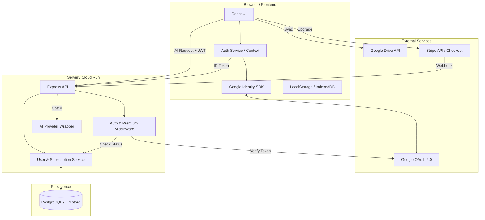
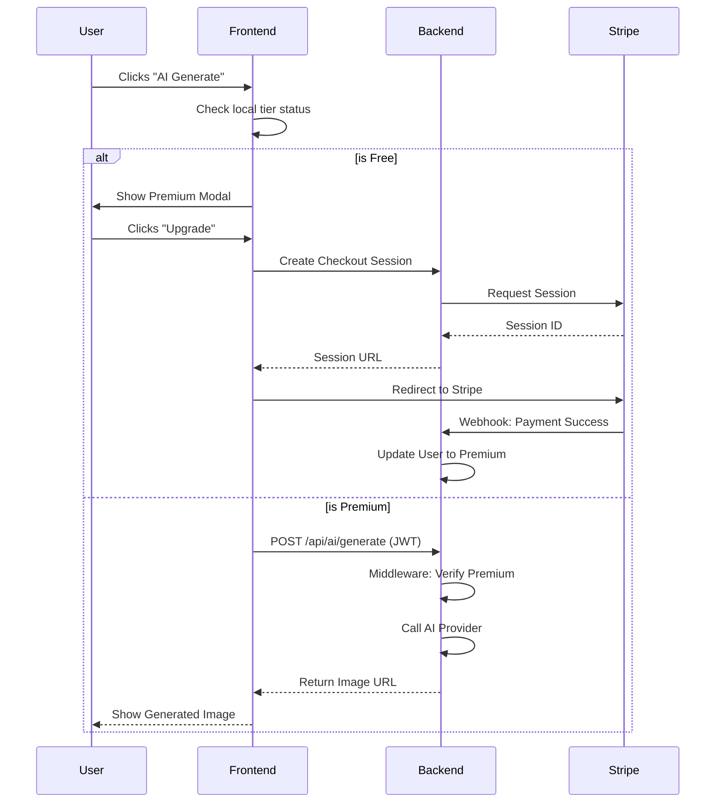

# Solution Design: User Authentication & Premium Tiers

## 1. High-Level Architecture

The following diagram illustrates the interaction between the CardCraft frontend, the backend services, and external providers (Google & Stripe).

## 2. Technical Component Breakdown

### 2.1 Authentication (Google Sign-In)
*   **Mechanism**: OpenID Connect (OIDC).
*   **Frontend**: Uses `google-one-tap` or `gapi` to obtain an ID Token.
*   **Backend**: 
    1.  Receives ID Token in `Authorization: Bearer <token>` header.
    2.  Validates via `google-auth-library`.
    3.  Upserts user record in `UsersDB` (Id matches Google `sub`).
    4.  Issues a stateless JWT (or continues using ID Token) containing the `user_tier`.

### 2.2 Access Control Logic (RBAC)
We utilize a multi-layered gating strategy:

1.  **Frontend Gating**: 
    *   UI elements (buttons, menus) are disabled or replaced with "Upgrade" prompts based on the `tier` property in the Auth context.
2.  **Backend Gating (Middleware)**:
    *   Specific routes (e.g., `/api/ai/generate`) are wrapped with `requirePremium` middleware.
    *   Metadata routes (e.g., `/api/user/status`) verify session validity.

### 2.3 Subscription Management (Stripe)
*   **Checkout**: Frontend redirects to a Stripe-hosted checkout page.
*   **Fulfillment**: Stripe sends a `checkout.session.completed` webhook.
*   **Database**: The backend updates the mapping of `google_id` -> `plan: 'premium'`.
*   **Portal**: A "Manage Subscription" link in the UI opens the Stripe Customer Portal for cancellations/billing updates.

## 3. Data Schema

### User Entity
| Field | Type | Description |
| :--- | :--- | :--- |
| `id` | UUID / Google Sub | Primary Key |
| `email` | String | User email for communications |
| `tier` | Enum | `free`, `premium` |
| `stripe_customer_id` | String | Link to Stripe Billing |
| `stripe_subscription_id` | String | Current active subscription ID |
| `created_at` | Timestamp | Account creation date |

## 4. Sequence Diagram: Feature Gating

## 5. Security Considerations
*   **Token Validation**: Always validate ID Tokens on the backend; never trust the frontend's claim of being "Premium".
*   **CORS**: Strict CORS policies to allow only the official frontend domain.
*   **Secrets**: All API keys (Stripe, Google, AI) are stored in Google Cloud Secret Manager.
